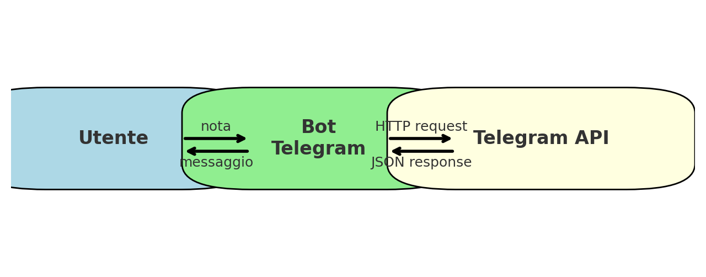
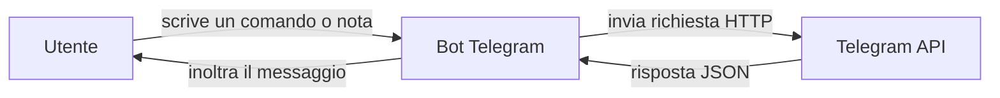

# Mini corso: Bot Telegram minimali

Benvenuti a questo mini corso sui **bot Telegram**.  
L'obiettivo è mostrare come creare un piccolo bot che funzioni come *recipiente di note personali*, inviando messaggi su Telegram da diversi linguaggi di programmazione.

Non entriamo ancora nei dettagli completi delle comunicazioni HTTP o delle API REST: questi verranno approfonditi in seguito.  
Qui ci concentriamo su esempi **essenziali e pratici**.

---

## 📚 Introduzione generale
- [Cos'è un bot e come usarlo come recipiente di note](bot_telegram_note.md)

---

## 🔄 Diagramma del flusso

Ecco come funziona il nostro bot a livello logico:



---

## 💻 Esempi pratici per linguaggio

### Java
- [NoteBotMin.java (Java 8, con HttpURLConnection)](NoteBotMin.md)

### PHP
- [noteBot.php (PHP, senza cURL)](NoteBotPHP.md)

### JavaScript / Node.js
- [noteBot.js (con async/await, Node 18+)](NoteBotJS.md)
- [noteBot.js (semplificato con .then(), Node 18+)](NoteBotJS_then.md)

---

## 📌 Come ottenere il `chat_id`
In tutti gli esempi, per inviare messaggi serve il **chat_id** della conversazione.  
Per ottenerlo:
1. Scrivi un messaggio qualsiasi al tuo bot su Telegram.
2. Apri nel browser:  
   ```
   https://api.telegram.org/botIL_TUO_TOKEN/getUpdates
   ```
3. Cerca nella risposta JSON il campo `message.chat.id` → quello è il tuo `chat_id`.

> 🔑 Perché serve questo passaggio? Telegram registra ogni messaggio come un *update*. `getUpdates` ti permette di leggere questa coda e scoprire in quale chat è avvenuto l'evento, fornendo così l'ID corretto.

---

👉 Questi esempi sono pensati per essere una **base semplice**: servono a prendere confidenza con i bot e a capire come inviare messaggi automatici.  
Nei capitoli successivi vedremo:
- come funzionano davvero le richieste HTTP (GET, POST, ecc.)
- l’uso di librerie più potenti (`cURL`, `axios`, ecc.)
- la gestione di casi più complessi (risposte automatiche, interazione con gli utenti, ecc.)
