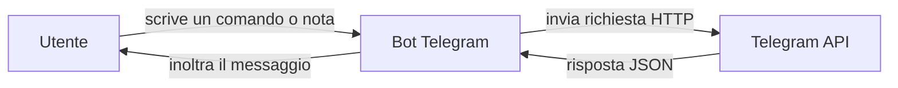

tra

# Mini corso: Bot Telegram minimali

Benvenuti a questo mini corso sui **bot Telegram**.  
L'obiettivo è mostrare come creare un piccolo bot che funzioni come *recipiente di note personali*, inviando messaggi su Telegram da diversi linguaggi di programmazione.

Non entriamo ancora nei dettagli completi delle comunicazioni HTTP o delle API REST: questi verranno approfonditi in seguito.  
Qui ci concentriamo su esempi **essenziali e pratici**.

---

## 📚 Introduzione generale
- [Cos'è un bot e come usarlo come recipiente di note](bot_telegram_note.md)

---

## Sicurezza

- [Note sulla sicurezza e privacy](bot_security.md)

---

## 🔄 Diagramma del flusso

Ecco come funziona il nostro bot a livello logico:

---

## 💻 Esempi pratici per linguaggio

### Java
- [NoteBotJava.java (Java 8, con HttpURLConnection)](NoteBotJava.md)

### PHP
- [noteBot.php (PHP, senza cURL)](NoteBotPHP.md)

### JavaScript / Node.js
- [noteBot.js (con async/await, Node 18+)](NoteBotJS_extra.md)
- [noteBot.js (semplificato con .then(), Node 18+)](NoteBotJS_lite.md)

---

👉 Questi esempi sono pensati per essere una **base semplice**: servono a prendere confidenza con i bot e a capire come inviare messaggi automatici.  
Nei capitoli successivi vedremo:
- come funzionano davvero le richieste HTTP (GET, POST, ecc.)
- l’uso di librerie più potenti (`cURL`, `axios`, ecc.)
- la gestione di casi più complessi (risposte automatiche, interazione con gli utenti, ecc.)
